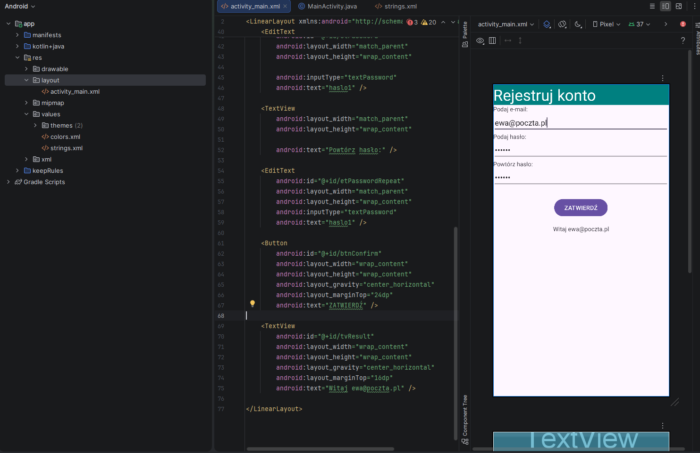

Ekran rejestracji konta odtworzony z arkusza egzaminacyjnego.

- Java
- Android SDK
- LinearLayout (pionowy)
- minSdk 24

-  Nagłówek na całą szerokość
- Pola e-mail i hasła
-  Wyśrodkowany przycisk i etykieta wyniku
-  Wszystkie teksty w strings.xml (do zrobienia)

## Autor

Jakub Perkowski